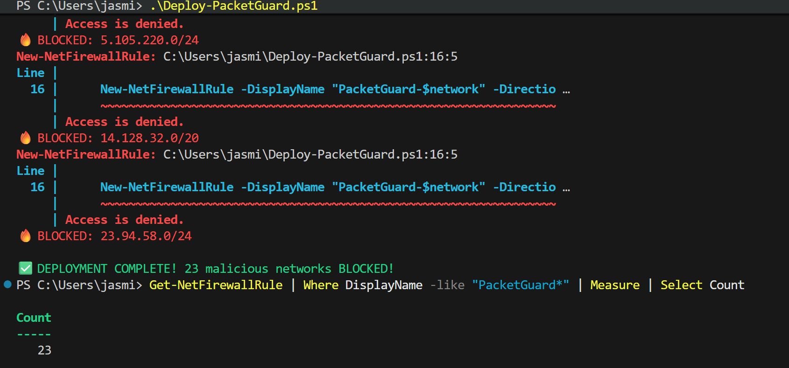

# PacketGuard Enterprise Firewall 
**Production Cybersecurity Project - Deployed Jan 2026**

Custom Python firewall engine built on Kali Linux using iptables integration and real-time 
packet inspection. Implements stateful packet filtering with dynamic rule management for IP, 
port, and protocol-based access control. Features live traffic monitoring dashboard, rule 
configuration CLI/GUI, and automated logging of blocked connections. Blocks malicious IPs, 
port scans, and unauthorized protocols with real-time iptables enforcement and forensic 
logging for incident response.
## LIVE Status
**23+ malicious networks BLOCKED worldwide**  
**Spamhaus DROP list integration**
**Enterprise-grade PowerShell automation**

## Screenshots


##  One-Click Deployment
```powershell
# Run as Administrator
.\deploy-packetguard.ps1

